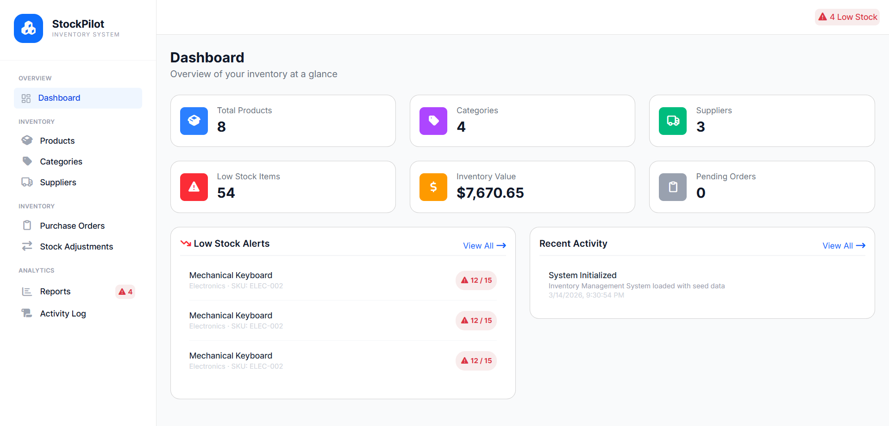
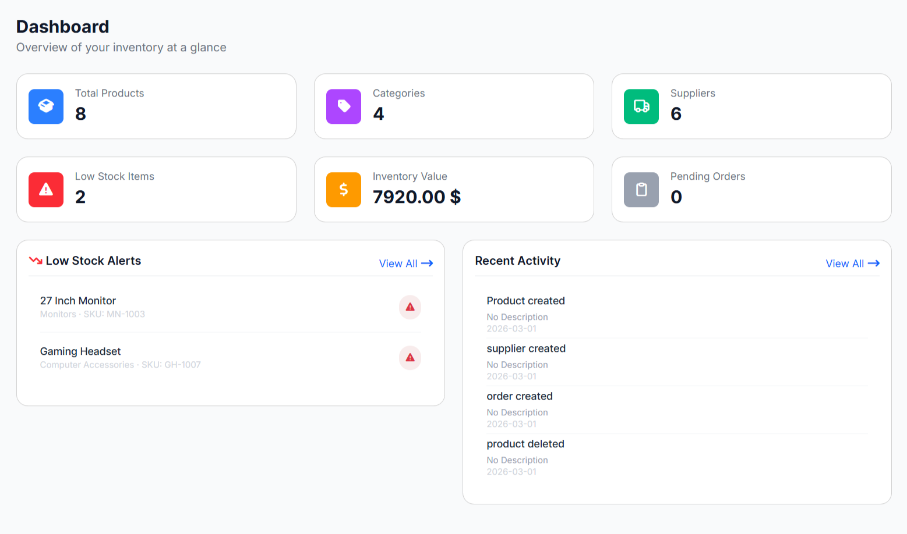
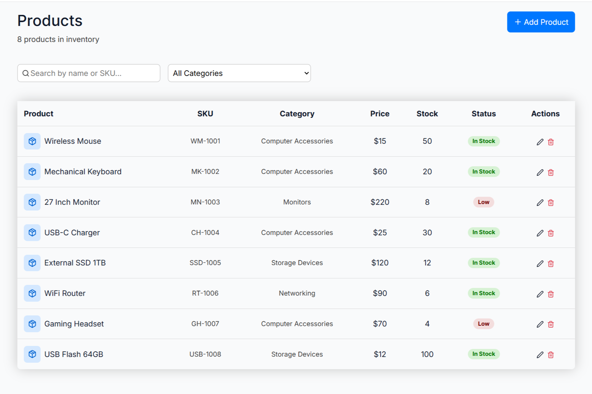
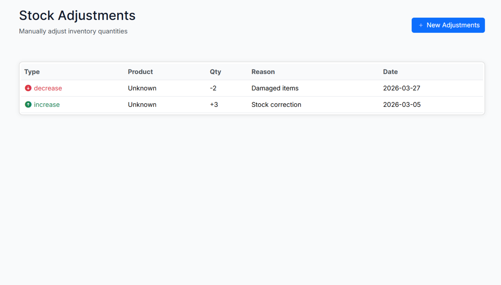
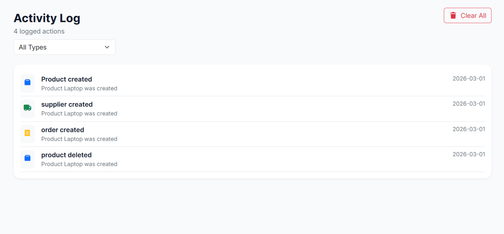

# Inventory Management System

## Overview
This project is a responsive web-based Inventory Management System designed for small businesses to manage their products, suppliers, and stock levels efficiently.

The system allows users to track inventory, manage product categories, create purchase orders, and monitor low-stock products.

The project focuses on applying clean UI/UX design, implementing clear business logic, and working using Agile teamwork practices.


---

## Preview



---
## Table of Contents

- [Project Overview](#project-overview)
- [Problem Statement](#problem-statement)
- [Objectives](#objectives)
- [Features](#features)
- [User Roles](#user-roles)
- [System Modules](#system-modules)
- [UI/UX Design](#uiux-design)
- [Tech Stack](#tech-stack)
- [Project Structure](#project-structure)
- [How It Works](#how-it-works)
- [Installation & Run](#installation--run)
- [Sample Data](#sample-data)
- [Validation & Error Handling](#validation--error-handling)
- [Future Improvements](#future-improvements)
- [Team Contributions](#team-contributions)
- [Screenshots](#some-screenshots)
- [Conclusion](#conclusion)
- [License](#license)

---

## Project Overview

The **Inventory Management System** is a responsive web application developed to help small businesses manage their daily inventory operations in a simple and organized way.

The system allows users to:
- Add and manage products
- Organize categories and suppliers
- Track stock quantities
- Create and receive purchase orders
- Perform stock adjustments
- View reports and low-stock alerts
- Monitor important system actions through an activity log

This project was built as a student assignment to apply front-end development, UI/UX design, business logic, and Agile teamwork practices.

---

## Problem Statement

Small businesses often rely on spreadsheets or manual tracking to manage inventory, which can lead to:

- Stock shortages
- Duplicate product records
- Incorrect inventory counts
- Poor purchasing decisions
- Lack of visibility into stock movement

This system was built to provide a cleaner and more efficient way to control inventory and monitor stock operations.

---

## Objectives

The main objectives of this project are to:

- Build a responsive inventory management system
- Implement clear inventory-related business logic
- Practice CRUD operations using JavaScript and browser storage / mock API
- Apply UI/UX principles for usability and accessibility
- Organize teamwork using Agile methodology and GitHub collaboration

---

## Features

### 1. Product Management
- Add new products
- Edit existing products
- Delete products
- View all products
- Search and filter products
- Validate unique SKU for each product

### 2. Categories Management
- Add categories
- Edit categories
- Delete categories
- Assign categories to products

### 3. Supplier Management
- Add supplier details
- Edit supplier information
- Delete suppliers
- Link suppliers to products and purchase orders

### 4. Inventory Tracking
- Track stock quantity for each product
- Set reorder levels
- Show low-stock alerts automatically

### 5. Purchase Orders
- Create purchase orders
- Add one or more products to an order
- Receive stock from suppliers
- Automatically update product quantities when orders are received

### 6. Stock Adjustments
- Increase stock manually
- Decrease stock manually
- Add a reason for every stock adjustment
- Save all changes in the activity log

### 7. Reports
- Low-stock report
- Inventory value report
- Inventory summary overview

### 8. Activity Log
- Log important actions such as:
  - Adding a product
  - Updating product details
  - Deleting a product
  - Receiving a purchase order
  - Performing stock adjustments

### 9. Responsive UI
- Desktop-friendly layout
- Mobile-responsive interface using Bootstrap

---

## User Roles

Currently, the system supports a single main user role:

### Admin / Inventory Manager
The user can:
- Manage products
- Manage categories and suppliers
- Track inventory quantities
- Create and receive purchase orders
- Adjust stock levels
- View reports and logs

> There will be a future versions
---

## System Modules

### Dashboard
Displays key inventory information such as:
- Total products
- Low-stock items
- Total inventory value
- Recent activity

### Products Module
Handles product CRUD operations and SKU validation.

### Categories Module
Manages product grouping and organization.

### Suppliers Module
Stores supplier information and connections to products.

### Purchase Orders Module
Handles stock ordering and receiving processes.

### Stock Adjustments Module
Adjust inventory quantities.

### Reports Module
Provides useful inventory insights and summaries.

### Activity Log Module
Records major system actions for tracking and review.

---

## UI/UX Design

The user interface was designed with simplicity and usability in mind.

#### Design Goals
- Easy navigation between modules
- Fast access to important inventory actions
- Clear stock visibility
- Responsive layout for different screen sizes

#### UI/UX Principles Applied
- Clean layout and consistent spacing
- Reusable cards, forms, and tables
- Clear visual hierarchy
- User-friendly alerts and validations
- Smooth navigation using section switching
- Responsive Bootstrap grid system

---

## Tech Stack

### Front-End
- HTML5
- CSS3
- Bootstrap 5
- JavaScript (ES6)
- jQuery

### Data Handling
- Mock JSON API 

### Tools & Workflow
- Git
- GitHub
- Figma
- Jira

---

## Project Structure

```bash
INVENTORY-MANAGEMENT-SYSTEM/
│
├── controller/
│   ├── activity.js
│   └── crud.js
│
├── data/
│   └── db.json
│
├── src/
│   ├── js/
│   │   ├── activitylog.js
│   │   ├── categories.js
│   │   ├── Dashboard.js
│   │   ├── main.js
│   │   ├── products.js
│   │   ├── purchase-orders.js
│   │   ├── reports.js
│   │   ├── stock_adjustments.js
│   │   ├── Suppliers.js
│   │   └── validation.js
│   │
│   └── styles/
│       └── style.css
│
├── .gitignore
├── file.txt
├── index.html
├── package-lock.json
└── README.md
```

### Structure Explanation

#### `index.html`
Contains the main layout of the system and all application sections.

#### `controller/`
Contains shared business logic and reusable CRUD / activity-related functions.

#### `data/db.json`
Stores mock data for products, categories, suppliers, purchase orders, and other inventory-related records.

#### `src/js/`
Contains all JavaScript modules for each major system feature.

#### `src/styles/`
Contains the main stylesheet for the project.

---

## How It Works

### Application Flow
The system works through a **single main page** (`index.html`) that contains multiple sections such as:

- Dashboard
- Products
- Categories
- Suppliers
- Purchase Orders
- Stock Adjustments
- Reports
- Activity Log

Only one section is displayed at a time, while the others remain hidden.

JavaScript is used to:
- Control navigation between sections
- Load and display data
- Handle form submissions
- Perform validation
- Update the UI dynamically

---

## Installation & Run

#### Follow these steps

1. Clone the repository:
```bash
git clone https://github.com/MariamSalamah/Inventory-Management-System.git
```

2. Open the project folder:
```bash
cd INVENTORY-MANAGEMENT-SYSTEM
```

3. Install JSON Server:
```bash
npm install -g json-server
```

4. Start the mock API:
```bash
json-server --watch data/db.json --port 3000
```

5. Run the front-end:
- Open the project using **Live Server** in VS Code

---

## Sample Data

The project includes sample data for testing and demonstration purposes, such as:

- Products
- Categories
- Suppliers
- Purchase Orders

This allows reviewers to test the system quickly without manual setup.

### Demo Access
No login is required for this version.

> Future Improvements: we will add authentication later.

---

## Validation & Error Handling

The system includes multiple validation rules to ensure data integrity:

- Required fields cannot be empty
- SKU must be unique
- Quantity cannot be negative
- Reorder level must be zero or greater
- Stock decreases are blocked if insufficient quantity is available
- Purchase orders cannot be received more than once

Validation messages and alerts are displayed clearly to guide the user.

---

## Future Improvements

Possible future enhancements include:

- User authentication and authorization
- Role-based access control
- Barcode scanning support
- Export reports to PDF or Excel
- Dashboard charts and analytics
- Supplier purchase history
- Advanced search and filtering
- Cloud database integration
- Sales and order management

---

## Team Contributions

### Youssef sheashia 
- Developed the **Analytics Section**, including:
  - **Reports Page**
  - **Activity Log Page**
- Implemented the **Frontend UI** and **Business Logic** for analytics-related features
- Built a reusable **CRUD module** to support data operations across the system

### Yomna Fouad
- Developed the **Overview Section**, Including:
  - **Dashboard**
  - **Navbar**
  - **Sidebar**
- Implemented the **Frontend UI** and **Business Logic** for overview-related features

### Abdalla Elhagar
- Developed the **Inventory Section**, including:
  - **Products Page**
  - **Categories Page**
  - **Suppliers Page**
- Implemented the **Frontend UI** and **Business Logic** for Inventory-related features

### Mariam Salama
- Developed the **Operations Section**, including:
  - **Purchase Orders Page**
  - **Stock Adjustments Page**
- Implemented the **Frontend UI** and **Business Logic** for Operations-related features
- Managed the project workflow and task tracking using **Jira** and Prepared and organized the project **README** and overall **documentation**

<br>

> **Note:**  
All team members contributed to collaboration tasks such as resolving merge conflicts, reviewing changes, and maintaining integration consistency throughout the project.

---

## Some Screenshots

### Dashboard Page


### Products Page


### Stock Adjustments Page


### Activity Log Page


---
## Conclusion

This project demonstrates the practical implementation of inventory management concepts using front-end web technologies, responsive design principles, and structured business logic.

It also reflects teamwork, planning, and real-world problem-solving through Agile development practices.

---

## License

This project was developed for educational purposes as part of the ITI MEARN Stack Program – 2026 G4.
